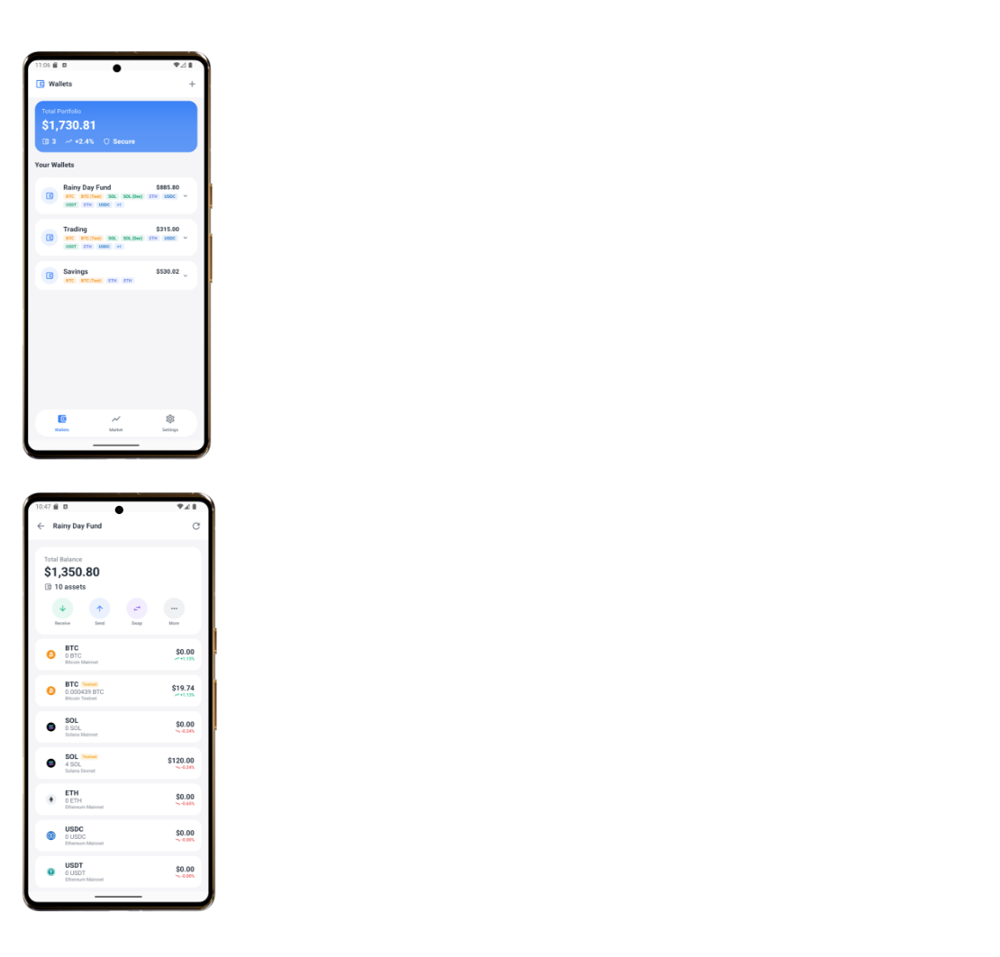

# Nexus Wallet 🔐 🚧 *Currently Under Development*

A cryptocurrency wallet for Android showcasing advanced technical skills in security, real-time data handling, and modern Android architecture.

> **Note:** This project is currently a work-in-progress and under active development.

## 📸 Screenshot

  

*Main dashboard showing account balances, trends, budgets, stats&summaries and recent transactions*

## 📸 Screenshot

  

*Main dashboard showing account balances, trends, budgets, stats&summaries and recent transactions*

## 🎯 Project Showcase

### 🔐 **Android Security Expertise**
- **BIP39** mnemonic generation with HD wallet derivation
- **Android KeyStore** encryption for seed phrase protection  
- **Biometric/Facial authentication** with PIN fallback
- **Encrypted local storage** using AndroidX Security Crypto
- **Secure transaction signing** without exposing private keys

### 🌐 **API Integration Mastery**
- **REST API consumption** (CoinGecko for market data)
- **WebSocket implementation** for real-time price updates
- **Public blockchain APIs** (Etherscan, Blockstream) for balance checking
- **Multi-source data aggregation** with offline-first caching

### 🏗️ **Modern Android Architecture**
- **Jetpack Compose** UI with Material Design 3
- **MVVM with Repository pattern** for clean separation
- **StateFlow/SharedFlow** for reactive state management
- **Hilt dependency injection** for testability
- **Navigation Component** with authentication middleware

## ✨ Key Features

| Feature | Status          | Description |
|---------|-----------------|-------------|
| 🔐 **Secure Wallet Creation** | ✅ Complete      | BIP39 12-word seed phrases with verification |
| 📈 **Real-time Market Data** | ✅ Complete      | Live prices with WebSocket updates |
| 👤 **Biometric Authentication** | ✅ Complete      | Fingerprint/Face ID + PIN protection |
| 💰 **Multi-Currency Support** | ✅ Complete      | Bitcoin, Ethereum, multi-chain wallets |
| 🎨 **Professional UI/UX** | 🔄 In Progress  | Jetpack Compose, Material Design 3 |
| 🔄 **Clean Architecture** | ✅ Complete      | MVVM, Repository pattern, StateFlow |
| 📊 **Portfolio Tracking** | 🔄 In Progress  | Balance aggregation & analytics |
| 🧾 **Transaction History** | 🔄 In Progress  | Blockchain API integration |

## 🛠️ Tech Stack

| Layer | Technology | Purpose |
|-------|------------|---------|
| **UI** | Jetpack Compose, Material Design 3 | Modern declarative UI |
| **Architecture** | MVVM, Repository Pattern | Clean separation of concerns |
| **DI** | Hilt | Dependency injection |
| **Networking** | Retrofit, OkHttp, WebSocket | API communication |
| **Persistence** | DataStore, Room | Local data storage |
| **Security** | Android KeyStore, Biometric API | Encryption & authentication |
| **Serialization** | Kotlinx Serialization | JSON parsing |
| **Async** | Kotlin Coroutines, Flow | Asynchronous programming |

⚠️ Disclaimer: This is a portfolio project demonstrating Android development skills. It is NOT intended for real cryptocurrency storage. Use at your own risk.
