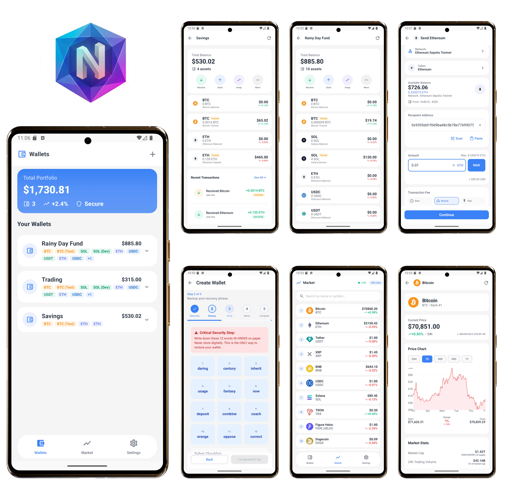

# Nexus Wallet 🔐 — Cryptocurrency Wallet for Android

**Nexus Wallet** is a self-hosted **oflfine-first** ryptocurrency wallet built with **Kotlin and Jetpack Compose**, showcasing advanced Android development skills in security, real-time data handling, and modern architecture. It connects to multiple blockchain APIs (Etherscan, Blockstream, Solana RPC) for secure balance checking and transaction management.

It allows users to **create wallets, manage multiple cryptocurrencies, send and receive transactions**, and monitor **real-time market data**.

> 🧠 **Note:** Nexus Wallet is a portfolio project demonstrating Android development expertise. Since it is under active development, **avoid using it for real cryptocurrency storage**.

---

## 📸 Screenshots

<div align="center">



*Wallet dashboard showing portfolio balance, multi-chain assets, and recent transactions*

</div>

---

## 🎯 Project Showcase

### 🔐 **Android Security Expertise**
- **BIP39 mnemonic generation** with 12-word seed phrases and verification step
- **Hierarchical Deterministic (HD) wallet derivation** for multiple cryptocurrencies
- **Android KeyStore encryption** for secure seed phrase and private key storage
- **Biometric authentication** (fingerprint/face ID) with PIN fallback
- **Encrypted local storage** using AndroidX Security Crypto for sensitive data
- **Offline-first architecture** with caching for balances, transactions, and wallet data; works without internet connection
- **Self-hosted architecture** with local-only key storage, no backend server
- **Secure transaction signing** without exposing private keys to the UI layer
- **Authentication middleware** for protected routes requiring biometric verification

### 🌐 **Multi-Blockchain Integration & Real-time Data**
- **Bitcoin** - Blockstream API integration for mainnet and testnet with RPC fallback
- **Ethereum** - Etherscan API + Web3j JSON-RPC for mainnet and Sepolia testnet
- **Solana** - Helius RPC API + Sol4k library for mainnet and devnet transactions
- **ERC-20 Token Support** - USDC and USDT with proper decimal handling (6 decimals for USDC/USDT)
- **SPL Token Support** - Solana token program integration for SPL tokens
- **Real-time price updates** - WebSocket connection to Binance WebSocket API for live cryptocurrency prices
- **Market data aggregation** - CoinGecko REST API for historical data and market trends
- **Crypto news aggregation** - CryptoPanic API for latest cryptocurrency news
- **JSON-RPC client** - Direct blockchain node communication via Web3j for Ethereum and custom RPC for Bitcoin/Solana

### 🔌 **Real-time Data & WebSocket Integration**
- **WebSocket connection** to Binance WebSocket API for live price streaming
- **Real-time price updates** for all many cryptocurrencies
- **Automatic reconnection** handling with exponential backoff
- **Price change indicators** updating in real-time without manual refresh
- **WebSocket event handling** for market depth and ticker updates
- **Background data synchronization** using Coroutine Flows
  
### 🏗️ **Modern Android Architecture**
- **Jetpack Compose UI** with Material Design 3
- **MVVM with Repository pattern** for clean separation of concerns
- **StateFlow/SharedFlow** for reactive state management
- **Hilt dependency injection** for testable and modular code
- **Navigation Component** with typed navigation and authentication middleware
- **Room Database** for offline-first caching of balances, transactions, and wallets
- **Coroutine Flows** for reactive data streams from database and network
- **Type-safe serialization** with Kotlinx Serialization

---

## 💎 **Advanced Features**

### Wallet Management
- **Multi-wallet support** - Create and manage multiple wallets
- **Network selection** - Mainnet and testnet support for all chains
- **Token selection** - Choose which tokens to enable per wallet
- **Wallet backup** - Seed phrase display with security checklist
- **Wallet restoration** - Import existing wallets from seed phrase
- **Wallet deletion** - Secure wallet removal

### Transaction Capabilities
- **Send transactions** - Native ETH, BTC, SOL, and ERC-20/SPL tokens
- **Receive transactions** - Generate QR codes for receiving addresses
- **Transaction review screen** - Review transaction details before sending
- **Fee level selection** - Slow, Normal, Fast priority fees
- **Max amount support** - Send entire balance minus network fees
- **Transaction history** - View recent and all transactions
- **Transaction details** - View transaction hash, fees, and explorer links

### Security Features
- **Biometric authentication** - Required for sensitive operations
- **Session timeout** - Automatic lock after inactivity
- **Secure key storage** - Private keys never stored in plain text
- **Transaction validation** - Balance checks, address validation, self-send protection

### Portfolio Management
- **Real-time portfolio tracking** - Total value across all wallets
- **Price change indicators** - 24h price changes for all assets
- **USD value display** - Convert crypto to fiat using real-time rates
- **Asset breakdown** - View balances per cryptocurrency
- **Market data** - Live crypto prices and market trends

### User Experience
- **Seed phrase security checklist** - Guided backup process with verification steps
- **Transaction status tracking** - Real-time status updates with explorer links after sending
- **Pre-transaction confirmation** - Dedicated review screen showing amount, recipient, and fees before signing
- **Destructive action confirmation** - Confirmation dialogs for dangerous actions
- **Pull-to-refresh** - Manual refresh of balances and transactions
- **Skeleton loading states** - Smooth loading experience
- **Error handling** - User-friendly error messages with retry options
- **Copy to clipboard** - Easy copying of addresses and transaction hashes
- **Share transactions** - Share transaction details with others
- **Toast notifications** - Immediate feedback for user actions

---

## 🛠️ Tech Stack

| Layer | Technology | Purpose |
|-------|------------|---------|
| **UI** | Jetpack Compose, Material Design 3 | Modern declarative UI with animations |
| **Architecture** | MVI, MVVM, Repository Pattern | Clean separation of concerns |
| **DI** | Hilt | Dependency injection |
| **Networking** | Retrofit, OkHttp, WebSocket (Binance), JSON-RPC | API communication, real-time price streaming, and blockchain RPC calls |
| **Persistence** | Room Database, DataStore | Local data caching |
| **Security** | Android KeyStore, Biometric API, Security Crypto | Encryption & authentication |
| **Serialization** | Kotlinx Serialization | Type-safe JSON parsing |
| **Async** | Kotlin Coroutines, StateFlow, SharedFlow | Asynchronous programming |
| **Navigation** | Compose Navigation | Type-safe routing with authentication |
| **Blockchain** | BitcoinJ, Web3j, Sol4k | Blockchain interaction libraries |
| **QR Code** | ZXing Android Embedded | QR code generation and scanning |

---

## 📱 Feature Roadmap

| Feature | Status | Description |
|---------|--------|-------------|
| ✅ Wallet Creation | Complete | BIP39 seed phrase with verification |
| ✅ Biometric Authentication | Complete | Fingerprint/Face ID + PIN protection |
| ✅ Multi-Wallet Support | Complete | Create and manage multiple wallets |
| ✅ Bitcoin Support | Complete | Mainnet & testnet transactions |
| ✅ Ethereum Support | Complete | Mainnet & Sepolia with ERC-20 tokens |
| ✅ Solana Support | Complete | Mainnet & devnet with SPL tokens |
| ✅ Token Support | Complete | USDC and USDT on EVM chains |
| ✅ Send/Receive | Complete | Full transaction flow |
| ✅ Transaction History | Complete | Recent and all transactions |
| ✅ Market Data | Complete | Live prices from CoinGecko |
| ✅ Portfolio Tracking | Complete | Total value across all assets |
| ✅ Crypto News | Complete | Aggregated news from CryptoPanic |
| ✅ Transaction Review | Complete | Confirm details before sending |
| 🔄 Wallet Import | In Progress | Restore from seed phrase |
| ✅ Price Charts | Complete | Historical price graphs |
| 🔄 Push Notifications | Planned | Transaction confirmations |
| 🔄 Multiple Languages | Planned | i18n support |

---

## 🚀 Getting Started

### Prerequisites
- Android Studio Hedgehog (2023.1.1) or newer
- JDK 17 or higher
- Android SDK API 24+ (Android 7.0)
- Device or emulator with biometric hardware (for fingerprint/face ID)

### API Keys Required

To run the app, you'll need to obtain API keys from the following services and add them to `local.properties`:

```properties
# Ethereum
ETHERSCAN_API_KEY=your_etherscan_api_key
ALCHEMY_API_KEY=your_alchemy_api_key

# Market Data
COINGECKO_API_KEY=your_coingecko_api_key
CRYPTOPANIC_API_KEY=your_cryptopanic_api_key

# Solana
HELIUS_API_KEY=your_helius_api_key
```

### Free API Sign-up Links:
- [Etherscan API](https://etherscan.io/apis) - Free tier: 5 requests/second
- [Alchemy](https://www.alchemy.com/) - Free tier: 300M compute units/month
- [CoinGecko API](https://www.coingecko.com/en/api) - Free tier: 50 calls/minute
- [CryptoPanic API](https://cryptopanic.com/developers/api/) - Free tier: 1000 requests/day
- [Helius](https://helius.xyz/) - Free tier: 50 requests/second

## 🚀 Getting Started

### Installation

1. **Clone the repository**
   ```bash
   git clone https://github.com/markgithinji/NexusWallet.git
   cd NexusWallet
   ```
2. **Create `local.properties` file**
   ```bash
   echo 'sdk.dir=/path/to/android/sdk' > local.properties
   ```
3. **Add API keys to `local.properties`**
   ```properties
   ETHERSCAN_API_KEY=your_key_here
   ALCHEMY_API_KEY=your_key_here
   COINGECKO_API_KEY=your_key_here
   CRYPTOPANIC_API_KEY=your_key_here
   HELIUS_API_KEY=your_key_here
   ```
4. **Open in Android Studio**
   - File → Open → Select the project folder
   - Wait for Gradle sync to complete

5. **Run the app**
   - Select a device/emulator
   - Click Run (▶️) button

---

## 🧪 Testing

### Manual Testing
- Create wallet with different network selections
- Test authentication with fingerprint/face ID
- Send and receive transactions (use testnet funds)
- Refresh data with pull-to-refresh
- View transaction details and explorer links
- Delete wallets and verify data removal

### Testnet Faucets
For testing transactions, use these testnet faucets:
- **Bitcoin Testnet**: [Bitcoin Faucet](https://coinfaucet.eu/en/btc-testnet/)
- **Ethereum Sepolia**: [Sepolia Faucet](https://sepolia-faucet.pk910.de/#/)
- **Solana Devnet**: [Solana Faucet](https://faucet.solana.com/)


---

## 🤝 Contributing

This is a portfolio project, but contributions and feedback are welcome! Feel free to:
- Open issues for bugs or feature requests
- Submit pull requests for improvements
- Share suggestions for architecture or UI improvements


---

## 🙏 Acknowledgments

- **BitcoinJ** - Bitcoin protocol implementation
- **Web3j** - Ethereum integration library
- **Sol4k** - Solana blockchain library
- **CoinGecko** - Cryptocurrency price data
- **Etherscan** - Ethereum blockchain explorer API
- **Blockstream** - Bitcoin blockchain explorer API
- **Helius** - Solana RPC infrastructure
- **Material Design 3** - Design system and components

---

**Built with ❤️ using Kotlin and Jetpack Compose**
   
